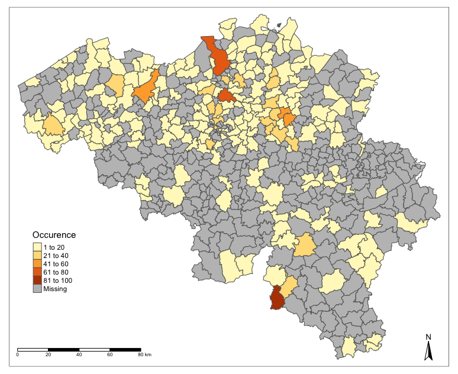

# Réalisation de cartes de la distribution des abeilles sauvages en Belgique

## Avant-propos

Les consignes sont reprises dans ce document, ainsi que sous forme de commentaires dans les différents fichiers. Elles sont susceptibles d'évoluer. N'hésitez pas à vérifier le lien suivant afin de voir si des modifications n'y ont pas été apportées : https://github.com/BioDataScience-Course/C06Ga_bees_belgium

## Objectifs

Cette assignation vous permettra de nous démontrer que vous avez acquis les compétences suivantes :

- Importer et manipuler des données spatiales dans R

- Réaliser des cartes professionnelles et pertinentes dans R

## Consignes 

Complétez le carnet de notes `bees_notes.Rmd` afin de proposer entre 2 et 5 cartes. Détaillez vos réflexions pour obtenir chaque carte. Votre objectif est donc de proposer une cartographie originale et instructive de la distribution des abeilles sauvages en Belgique. Respectez les règles qui font que votre carte aura un rendu professionnel.

Vous pouvez réaliser vos cartes avec {chart}, {ggplot2}, {mapview}, {leaflet} ou encore {tmap}. Il est donc intéressant de proposer différentes cartes réalisées avec les différents packages pour montrer que vous les maîtrisez.

Vous avez à votre disposition différentes données :

- `wild_bees_belgium.rds` est un fichier au format RDS qui comprend un sous échantillon des données Wild Bees of Belgium depuis le DOI [`DOI10.15468/dl.465vwp`](https://www.gbif.org/dataset/0d7c6a1a-0aab-47dc-8256-f23fefac69cd). 

- Le dossier `map_belgium` comprend plusieurs fichiers nécessaires à la réalisation de cartes de la Belgique, détaillées par communes. Ces données proviennent de <https://www.geo.be/catalog/details/fb1e2993-2020-428c-9188-eb5f75e284b9?l=fr>. Vous avez la possibilité de travailler plutôt sur la cartes des régions ou des provinces, si vous le souhaitez.

- Vous avez le droit d'ajouter des données supplémentaires mais votre projet doit rester reproductible et comprendre l'ensemble des fichiers sous une forme qui tient dans un dépôt GitHub. Faites donc attention à la taille de vos fichiers et limitez-vous aux données strictement indispensables pour vos cartes (utilisez des scripts d'importation et nettoyage des données pour que cette étape d'importation et tri soit reproductible).

Vous avez un script qui vous présente le pré-traitement des données et un script qui vous propose un exemple de carte. N'hésitez pas à vous en inspirer.

## Astuces

Comme vous pouvez le voir dans le script R, les fichiers de base se trouvent dans un dossier `data/raw`. Les fichiers bruts disponible sur le net étant trop voluminerux, ils sont volontairement exclus du gestionnaire de version.

La réalisation de cartes est quelques choses de chouette à réaliser. On cherche des fonds de carte au format GeoTIFF, des shapefiles de ESRI ou encore directement des données à partir d'un package R et puis on fait une carte. C'est assez simple dans R et il ne faut pas diposer d'un programme dédié et complexe de cartographie. Cependant, la taille des fichiers et le temps de calcul selon la puissance votre ordinateur peuvent souvent être un problème. Nous vous conseillons d'employer `aggregate()` afin de réduire la résolution d'un raster. Vous pouvez aussi utiliser `sf::st_simplify()` pour réduire la complexité (et la résolution) d'un objet **sf**.
